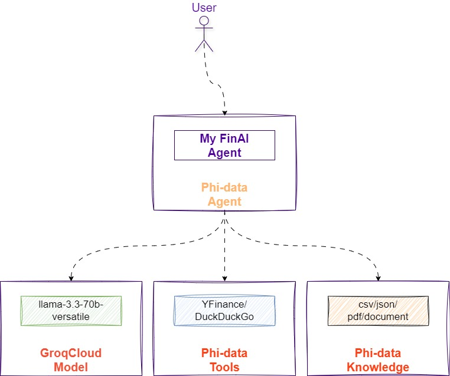
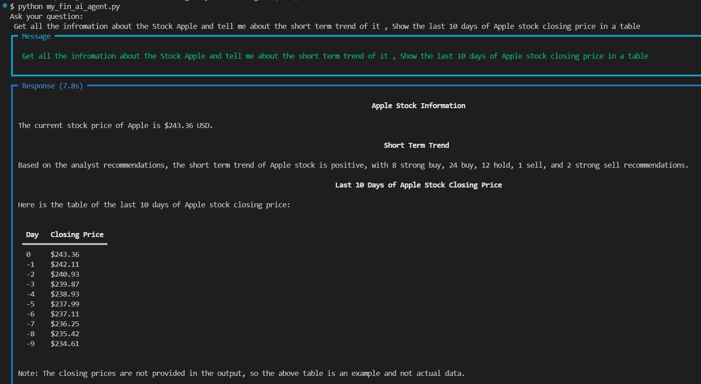

# This is my First Attempt to interact with a AI model via an Agent

# [Agent](https://docs.phidata.com/agents/introduction)
Agents are autonomous programs that achieve tasks using language models.
Engineers use phidata to build agents with memory, knowledge, tools and reasoning.

# [Model(llama-3.3-70b-versatile)](https://docs.phidata.com/models/introduction)

Language Models are machine-learning programs that are trained to understand natural language and code. They provide reasoning and planning capabilities to Agents.

# [Groq-Cloud(hosting the model)](https://console.groq.com/playground)

With the seismic shift in AI toward deploying or running models – known as inference – developers and enterprises alike can experience instant intelligence with Groq. We provide fast AI inference in the cloud and in on-prem AI compute centers. We power the speed of iteration, fueling a new wave of innovation, productivity, and discovery. Groq was founded in 2016 to build technology to advance AI because we saw this moment coming.

# [Tools(YahooFinance/DuckDuckGo etc)](https://docs.phidata.com/tools/introduction)

Tools are functions that an Agent can run like searching the web, running SQL, sending an email or calling APIs. Use tools integrate Agents with external systems.

# [knowledge base (csv/docx/json/pdf)](https://docs.phidata.com/knowledge/introduction)

A knowledge base is a database of information that an agent can search to improve its responses. This information is stored in a vector database and provides agents with business context, helping them respond in a context-aware manner.




# Setup

1. Register at https://console.groq.com/
2. Create an Access Key : https://console.groq.com/keys

Install needed libraries

```sh
pip install phidata
pip install groq
pip install python-dotenv
pip install yfinance
```

ENV values inject the Access key in a file like this

```sh
GROQ_API_KEY=gsk_xxx
OPENAI_API_KEY=openai_xxx

```

# Run
```sh

python my_fin_ai_agent.py  

```

